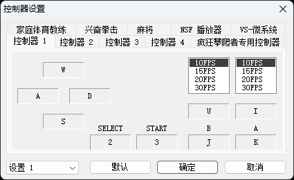
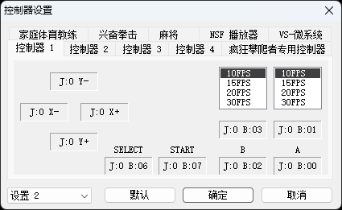
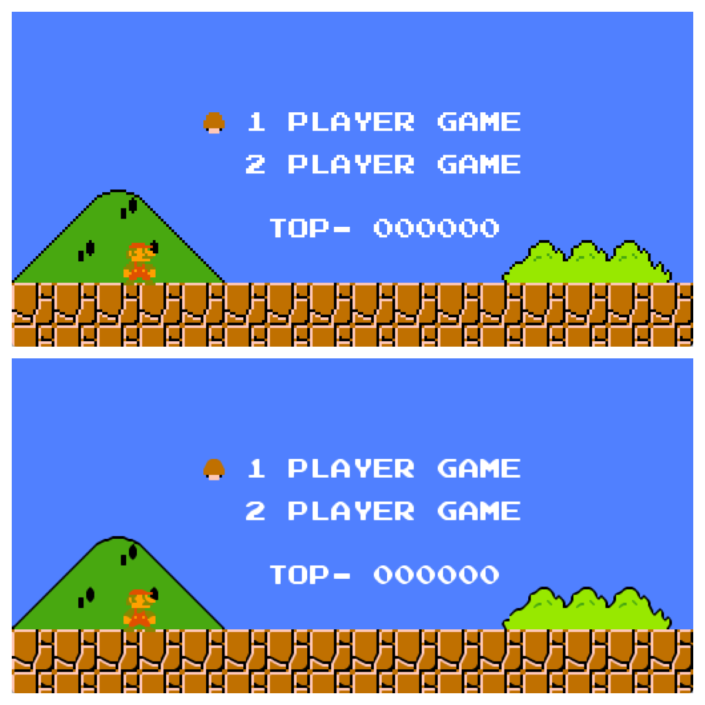
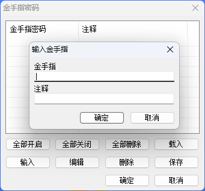
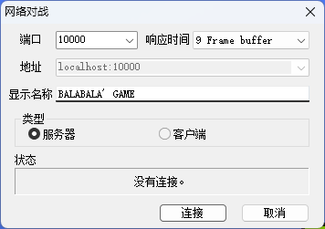

# virtuaNES

virtuaNES 是一个经典的红白机模拟器，不过可能很多人对他的功能还不是很熟悉，这里就来简单挖掘一下 virtuaNES 的一些功能。

## 基础功能

### 语言

网络上下载到的 virtuaNES 应该是中文版，如果下载的是英文版的话，也可以自己手动下载并添加语言包，将语言包文件(`.vlp`)放入程序主文件夹下，然后重启 virtuaNES 并在菜单栏中选择*选项->语言*就能切换语言了。如果下次默认还是使用英文打开，也可以将英文语言包改一个后缀名(如`English.vlp2`)，这样下次打开就自动显示中文了。

### 键位设置

默认的快捷键可能不适用所有玩家，在游玩之前建议将控制键改为自己顺手的样子。控制键在菜单栏*选项->控制器*中设置。

如果同时使用手柄和键盘的话，也可以点击左下角的设置 2，分配第二套配置，这两套配置可以同时生效。

要双人游玩的话，同理为控制器 2 设置一套键位。

### 即时存档/读档设置

SL 大法是大家都听说过的一种玩法，用这种办法，哪怕是手残玩家也可以轻松通关一些困难游戏，毕竟再手残的玩家，多试几次总能过去的嘛。默认的 SL 键位即字母 SL 键，和玩家常用的 WSAD 键位冲突。

所以建议为这两个键重新分配快捷键，例如惯用左手的话，就分配 QE，惯用右手的话，就分配个 79，怎么顺手怎么来嘛。设置方法，菜单栏*选项->快捷键*，找到*即时存档/读档*，双击并添加一个新按键。

### 画面设置

默认的窗口大小不合适？在菜单栏*选项->窗口缩放*就可以调整窗口大小，默认快捷键是 F5-F8，对应四种大小。

如果你愿意的话，还可以开启画质增强，让 NES 画面变得更加细腻一点。在菜单栏*选项->过滤*里，可以找到多种过滤方法，开启之后即可降低锯齿，提高画质。

下图的例子是没开启过滤和开启了*hq2x*过滤的画质差别，可以看到效果还是很明显的。

## 高级功能

### 金手指

金手指也即作弊码，通过直接修改内存的功能，达到正常游戏所不能的效果，如马里奥的无限金身等等，可以彻底改变游戏体验。特别是对于一些手残玩家，以前打不过去的游戏，现在可以轻松的通关。

金手指功能通过菜单栏*工具->金手指*开启。金手指代码可以通过搜索引擎搜索，以后本站也会慢慢收录一些经典游戏的金手指。找到金手指代码以后，输入进去，然后点击开启，再回到游戏，就可以看到效果了。有了金手指这个强大的外挂，配合即时存档和读档功能，再难的游戏也不怕打不过去啦！

### 网络对战

没错，virtuaNES 其实是支持网络对战的，但是这个功能我居然一直没有发现。有了这个功能，哪怕相隔天南地北的朋友，也能跨越网络，一起重温儿时的快乐。

点击菜单栏*文件->网络对战*，打开网络对战对话框。服务端玩家按下图进行设置，响应时间要选的大一点，不然对战会一卡一卡的。

客户端同样打开网络对战对话框，在这里选择客户端，然后输入服务端的主机名和端口号即可连接。

一般家用宽带都没有公网 IP 地址，所以这个功能只能局域网对战。不过通过内网穿透工具如[cpolar](https://www.cpolar.com)，就可以为本地端口分配一个远程地址，这样其他玩家就可以通过公网 IP 进行连接了。
